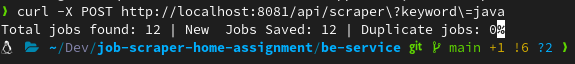

# Technical Assessment
Develop a web application that scrapes job listings from a job website in Nepal and provides an API to search and list jobs based on a keyword.
(Assessment description omitted)

# Backend
## Endpoints
The application runs on port: **8081 (localhost)**
### Scraper:
1. ```POST http://localhost:8081/api/scraper?keyword={keyword}```
    - Example: ```POST http://localhost:8081/api/scraper?keyword=java```
    - This endpoint runs the scraper which scrapes all the jobs that are found after using the keyword (java, here)
      stores the results to the database.


2. ```POST http://localhost:8081/api/scraper```
    - This endpoints runs the scraper which scrapes all jobs available on the website

```
    Note:
    The endpoint may result in a timeout exception if there is a large number of jobs to scrape.
    But, even though you get a time out exception the script will continue running on the background.
    So, to actually see the scrapers progress please check the logs on the console 
```

### Jobs:
1. ```GET localhost:8081/api/jobs```
    - This endpoint returns list of all the available jobs on the database.
2. ```GET localhost:8081/api/jobs?keyword={keyword}```
    - This endpoint returns a list of jobs that match the provided keyword in the job title or description.
    - Example: ```GET localhost:8081/api/jobs?keyword=java```
3. ```GET localhost:8081/api/jobs/{id}```
    - This endpoint returns detailed information for a specific job based on the job ID.
    - Example: ```GET localhost:8081/api/jobs/10```
4. ```GET http://localhost:8081/api/jobs?keyword={keyword}&pageNo={pageno}&pageSize={pagesize}```
    - This endpoint returns a list of jobs that match the provided keyword in the job title or description.
      But, paginates the results.
    - Example: ```GET http://localhost:8081/api/jobs?keyword=java&pageNo=0&pageSize=15```
5. ```GET http://localhost:8081/api/jobs?pageNo={pageno}&pageSize={pagesize}```
    - This endpoint returns list of all the available jobs in the database and paginates them.
    - Example: ```GET http://localhost:8081/api/jobs?pageNo=0&pageSize=10```

## Running the project
The dependencies are:
- OpenJDK Java version >= 21
- Docker
- Maven
- Spring Boot: v3.3.4

1. Make sure docker is installed in your system.
2. Clone the project. cd into the be-service directory.
3. Initialize the database by running:
   ```
    docker compose up
   ```
    - Make sure nothing is running on your port 5432 (localhost)
    - The application will create the initial table schema on startup.
      - No migration tools has been used. So, you will need to hit one of the following endpoint 
        after application starts to populate the database tables.
        **Endpoints that can be used to populate the table:**
        - Use this endpoint below ,with keyword, for pouplating the table with few data for testing purposes. This query is probably going to scrape about 10 to 15 jobs and pouplate it. If you
        use the other endpoint it will take a lot of time.
        ```
        POST http://localhost:8081/api/scraper?keyword=java
        ``` 

        ```
        POST http://localhost:8081/api/scraper
        ```
4. Starting the spring boot application:
   - cd into the be-service directory
   - run: ```mvn spring-boot:run```
   - If you have intellij installed on your system open the be-service folder with intellij and hit the run button on top.


## Some images of request and response:

```
    Note: 
    Please use postman or thunderclient or intellij's built http client
    The outputs will be easier to read and formatted unlike shown
    in the pictures below.
    I was just testing out for writng this readme, so I just used the termnial and curl
```

1.Scraper Request```POST http://localhost:8081/api/scraper?keyword=java``` 


2. Logs while scraper is running:


3. Request to get job by id ```GET localhost:8081/api/jobs/10```


4. Request to get all jobs ```GET localhost:8081/api/jobs```


5. Request to get jobs by keyword ```GET localhost:8081/api/jobs?keyword=Dotnet```
